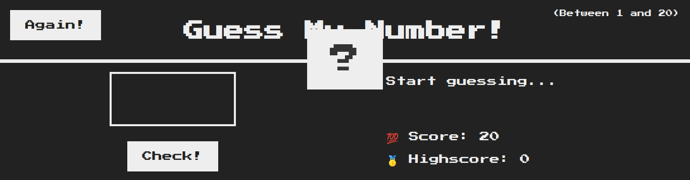

# forkify Project

Recipe application with custom recipe uploads.

> # Description / Descrição

Forkify is a recipe web app using the Forkify API to allow users to search, view, modify, bookmark and add recipes. This app uses modern JavaScript tools, such as Parcel to bundle the modules, and Babel to convert ES6, ES7 and ES8 back to ES5.

[🔗 Click here to access / Clique aqui para acessar]()

## 🛠️ Technologies / Tecnologias

- JavaScript
- HTML
- CSS
- Git e Github

## 📣 Contact / Contato

vitorfelipenery@gmail.com
